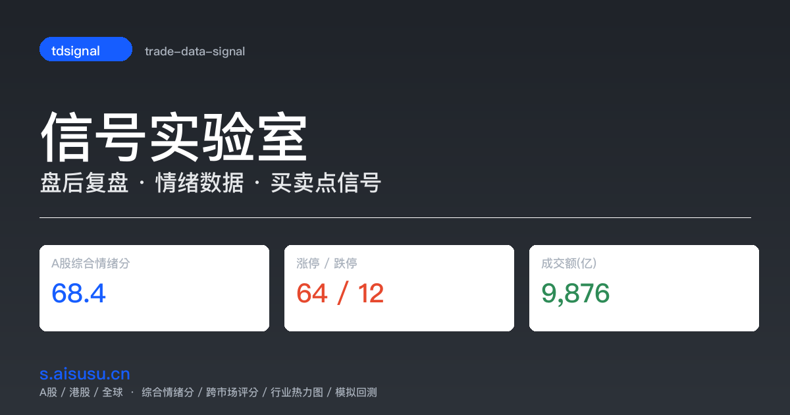

# 📊 市场温度看板 · tdsignal

> A股 / 港股 / 全球 盘后复盘 **市场温度看板** —— 把散落各处的情绪值、涨跌家数、连板高度、买卖点信号汇总到一处，攒成历史序列，辅助判断市场情绪拐点与买卖时机。

**在线体验**：http://tdsignal-ujpzw01zm.maozi.io/



`trade-data-signal` / `tdsignal` / `tdsignal-ujpzw01zm`

---

## ✨ 核心功能

### 🌡️ 情绪温度计
- **A股综合情绪分**（0-100，6 指标加权：涨跌比/涨停数/炸板率/连板高度/成交额/北向资金）
- **跨市场综合评分**（去极值截尾均值，跨 A股/港股/全球）
- **恐贪指数**（8 情绪分等权合成）
- 6 个宽基指数独立情绪分：上证50 / 沪深300 / 中证500 / 中证1000 / 创业板 / 科创50
- 阈值标注：< 20 = 冰点 🔵，> 80 = 过热 🔴

### 📈 买卖点信号（事件化 + 回测验证）
- **主买**：RSI(14) 上穿 30（超卖反弹拐点）
- **辅买**：布林下轨回归（BB lower revert，强势市更敏感）
- **卖点**：20 日高点回落 5% + MA60 多头过滤 + MACD 死叉确认
- 每个信号附 **回测统计**（胜率/盈亏比/样本数/凯利仓位），样本不足自动标注
- **82 品种模拟回测**：全历史信号 × 5/10/20 日 forward 收益

### 📊 市场宽度
- 涨跌家数、涨停/跌停、连板高度、炸板率、封板率、打板溢价
- 涨跌家数比 + 腾落线（AD Line）
- 成交量对比（放量/缩量标注）
- 新高新低家数（52 周 / 20 日）

### 🏭 行业与轮动
- 申万 31 行业涨跌幅热力图（近 1 日 / 近 5 日切换）
- 行业资金流 + 换手率 + 行业内宽度
- 板块轮动速度（5/10/20 日窗口）
- 行业卡片标注对应主流 ETF（点击复制）

### 🏦 期货机构持仓
- 中金所 IF/IC/IH/IM 前 20 会员净多空持仓
- 机构 / 中信 / 国君 三角色持仓追踪
- 同向准确率（跟随机构）+ 逆向准确率（对冲思维）

### 📌 大盘位置感
- 8 指数当前价格在历史区间的分位（进度条可视化）
- 均线排列状态（多头/空头/震荡统计）
- 一句话总结（规则引擎 + 历史回看）

---

## 🛠️ 技术栈

| 层 | 技术 |
|---|---|
| 后端 | Python 3.11 + FastAPI + SQLite |
| 前端 | 原生 JS + ECharts（无构建步骤） |
| 数据源 | akshare（东财/新浪/腾讯）+ mootdx（TCP 日线）+ BaoStock |
| 部署 | Cloudflare Pages（静态站）/ 本地 FastAPI（动态） |
| 定时 | macOS launchd / cron，每交易日 15:30 后采集 |

**特点**：
- 全量免费数据源，无 API key
- 指标配置驱动（`config/indicators.yaml`），增删改不动核心代码
- 双部署：动态版（FastAPI 实时查询）+ 静态版（预生成 JSON，CDN 加速）
- 历史 10 年回溯（mootdx 全 A 股日线 16M 行 + BaoStock 校验）

---

## 🚀 快速开始

```bash
# 1. 安装依赖（国内镜像）
python3 -m venv .venv
.venv/bin/pip install -i https://pypi.tuna.tsinghua.edu.cn/simple -r requirements.txt

# 2. 初始化数据库
.venv/bin/python -m app.db

# 3. 首次回填历史数据
.venv/bin/python -m app.backfill

# 4. 启动看板
.venv/bin/uvicorn app.main:app --host 0.0.0.0 --port 8000
# 浏览器打开 http://localhost:8000
```

### 定时采集（每交易日 15:30）
```bash
cp launchd/com.trade.sentiment.plist ~/Library/LaunchAgents/
launchctl load ~/Library/LaunchAgents/com.trade.sentiment.plist
```

或一键脚本 `bash scripts/update_all.sh`（采集 + 静态导出 + 推送部署）。

---

## 📁 项目结构

```
app/
├── collector/      # 采集层（akshare/mootdx/baostock + em_get 防封）
├── compute/        # 计算层（signals 买卖点 / sentiment 情绪分 / cross 跨市场分）
├── db.py           # SQLite schema
└── main.py         # FastAPI 端点
web/                # 动态版前端（FastAPI 服务）
static-site/        # 静态版前端（Cloudflare Pages 部署）
config/indicators.yaml  # 指标注册表（增删改这里）
scripts/            # 采集/部署/一键更新脚本
```

详细文档：
- [REQUIREMENTS.md](REQUIREMENTS.md) - 需求 + 数据字典 + 公式披露
- [HELP.md](HELP.md) - 使用方法 + 故障排查
- [NOTES.md](NOTES.md) - 调研笔记 + 修复历史

---

## ⚠️ 声明

本看板仅供学习研究，**不构成投资建议**。买卖点信号为历史回测参考，胜率接近随机，不可作为独立交易依据。数据准确性受数据源限制，请以官方披露为准。

## 📄 License

MIT
