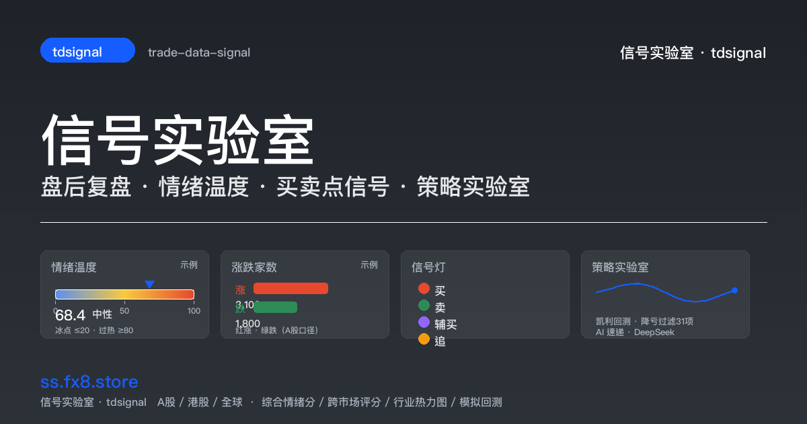

<!-- SVG-BANNER-START -->
<p align="center">
  <svg xmlns="http://www.w3.org/2000/svg" width="780" height="180" viewBox="0 0 780 180">
    <defs>
      <linearGradient id="tdg" x1="0%" y1="0%" x2="100%" y2="0%">
        <stop offset="0%" stop-color="#00D4FF" />
        <stop offset="48%" stop-color="#7B2FFC" />
        <stop offset="100%" stop-color="#00FF88" />
      </linearGradient>
      <linearGradient id="line" x1="0%" y1="0%" x2="100%" y2="0%">
        <stop offset="0%" stop-color="#00D4FF" stop-opacity="0" />
        <stop offset="50%" stop-color="#00D4FF" stop-opacity="0.4" />
        <stop offset="100%" stop-color="#00D4FF" stop-opacity="0" />
      </linearGradient>
      <filter id="glow">
        <feGaussianBlur stdDeviation="2" result="coloredBlur"/>
        <feMerge>
          <feMergeNode in="coloredBlur"/>
          <feMergeNode in="SourceGraphic"/>
        </feMerge>
      </filter>
    </defs>
    <rect width="780" height="180" rx="18" fill="#0D1117" />
    <rect x="30" y="30" width="720" height="120" rx="10" fill="none" stroke="url(#line)" stroke-width="1.5" />
    <text x="390" y="105" font-family="-apple-system, BlinkMacSystemFont, 'Segoe UI', Roboto, Arial, sans-serif" font-size="76" font-weight="900" fill="url(#tdg)" text-anchor="middle" letter-spacing="12" filter="url(#glow)">TDSIGNAL</text>
    <circle cx="170" cy="138" r="4.5" fill="#00FF88" />
    <circle cx="170" cy="138" r="8" fill="#00FF88" opacity="0.3" />
    <text x="192" y="143" font-family="'Courier New', Courier, monospace" font-size="14" fill="#00D4FF" font-weight="bold" opacity="0.9">A股 · 港股 · 全球</text>
    <text x="560" y="143" font-family="'Courier New', Courier, monospace" font-size="14" fill="#7B2FFC" font-weight="bold" opacity="0.9">◆  ONLINE  ◆</text>
    <path d="M 80 158 Q 160 140 240 158 T 400 158 T 560 158 T 700 158" stroke="#00D4FF" stroke-width="1.2" fill="none" opacity="0.25" />
    <path d="M 120 165 Q 200 152 280 165 T 440 165 T 600 165" stroke="#7B2FFC" stroke-width="0.8" fill="none" opacity="0.15" />
  </svg>
</p>
<!-- SVG-BANNER-END -->

# 📊 信号实验室 · tdsignal

> **A股/港股/全球盘后复盘情绪数据看板** —— 把散落各处的情绪值、涨跌家数、连板高度、买卖点信号、ETF 评分、策略实验室汇总到一处，
> 攒成历史序列，用**数据挖掘**从数千笔回测交易中反推出"降亏过滤标志"，每日用 **AI** 生成白话速递，
> 辅助判断市场情绪拐点与买卖时机。

**一句话**：免费数据源 + 情绪指数 + ETF 评分 + 凯利仓位回测 + 数据挖掘降亏过滤 + AI 每日速递，
一个把「数据采集 → 计算 → 可视化 → 交易信号 → 信号质量挖掘 → AI 解读 → 自动交易执行」全链路打通的开源情绪数据看板。


---

**在线体验**：<https://ss.fx8.store/>（CF Workers 主站，wrangler.jsonc 绑定，push main 自动 deploy，支持 br 压缩 + `_headers` CSP/HSTS）

**备用站点**：
- <https://sss.sugas.site/>（GitHub Pages）
- <https://s.sugas.site/>（MaoziYun，300MB 总大小限制）
- <https://ssd.fx8.store/>（R2 CDN，大 JSON 产物）



`trade-data-signal` / `tdsignal`

---

## 🎯 核心诉求（投资理念）

> 本项目的第一设计准则，由项目作者定调（2026-08-23），是所有策略挖掘与推荐的最高评估标准：

- **平稳优先，宁可少赚**：最关注**月月赚钱、年年赚钱、少回撤**——类似「定期 / 红利」型理财思路；明确不喜欢"大亏 + 大赚"剧烈起伏的玩法（绝对值再高也影响心态、拿不住）。
- **为什么选 ETF 而非个股**：不是为了博取个股那样特别大的上升空间——因为同样害怕个股那样特别大的下跌空间。ETF 的波动特性与本项目的平稳诉求天然契合。
- **落到策略评估上**：任何回测/方案对比，**先看最大回撤与月度盈亏稳定性，再看收益**（收益名次 + 平稳名次双维综合）；空仓、机会少不是缺点，大起大落才是。
- **落地体现**：数据挖掘「降亏过滤」体系、AI 降亏模式族（**v1.1.5 起默认基座=NEW 14键防守王** / 8键旧默认对照档 / A 进攻王 / C 保守防守等画像分级）、以及调研中的 AUTO 择时自动切换（进攻型只在牛市确认段上场），全部以本诉求为最高准则。

---

## ✨ 功能亮点

> **定位**：A股·港股·全球 三大市场一站式智能决策看板 —— 从市场情绪到买卖点，让每一笔决策都有数据与回测背书。

### A. 行情与情绪监控
> 复盘必备：一眼看清市场温度、板块冷暖与全球动态。

- 🔹 **AI 监控卡** — 全程盯「策略会不会过拟合」：实盘 vs 回测双线对照 + 综合风险分（绿/黄/红），异常自动预警到邮件/飞书（详见 [`docs/kelly/analysis/kelly-overfit-monitor-design.md`](docs/kelly/analysis/kelly-overfit-monitor-design.md)）
- 🔹 **情绪温度计** — 一眼看清市场过热/冰点：A股综合 + 跨市场 + 恐贪 + 6 宽基独立情绪分（10 年回溯），附买卖点信号作情绪拐点参考（详见 [`docs/market-state/market-state-analysis.md`](docs/market-state/market-state-analysis.md)）
- 🔹 **全球盘面跑马灯** — 9 大全球品种实时行情（黄金/原油/外汇/外围股指），纯客户端直连第三方、零服务器压力、多源自动兜底（详见 [`docs/global-ticker-free-source-research.md`](docs/global-ticker-free-source-research.md)）
- 🔹 **市场宽度·行业轮动·期货持仓** — 涨跌家数/腾落线/新高新低、申万 31 行业热力图+资金流、期货主力净多空，看板块冷暖与机构动向（数据层详见 [`docs/data-dictionary.md`](docs/data-dictionary.md)）

### B. 智能交易决策
> 从信号到仓位，AI 把「交易什么、何时交易、买多少」一次说清。

- 🔹 **买卖点信号** — 主买/辅买/卖点信号，每个附回测胜率+凯利仓位；A股指数信号收盘即固化、不再消失（详见 [`docs/signal-finalize-time.md`](docs/signal-finalize-time.md)）
- 🔹 **回测买入价口径（v1.1.4 起默认=信号次日开盘）** — 凯利回测默认买入价由「信号日收盘等价 accum_nav」切换为「信号次日开盘价」（信号收盘后固化、次日开盘才能真实成交，按 gap 比例换算到 accum_nav 口径，正确处理分红/份额折算）；量化证明切换成本极小（净利仅微降 0.01%~0.57%、收益率基本不变、相对结论原样成立），详见 [`docs/kelly/position/kelly-nextday-open-backtest.md`](docs/kelly/position/kelly-nextday-open-backtest.md)
- 🔹 **信号对错判定 · N 交易日到期冻结窗（2026-08-24 全站统一口径）** — 首页技术参考点/警示块/AI 监控卡的「信号后对错」由无时间窗的「至今走势」口径统一切换为**到期冻结窗**：满窗以信号日后第 N 个交易日收盘价定案（此后不再变），未满窗按至今走势暂计并标「未定案」——买入四类+卖/止损卖默认 **10 日**（与主推 A 方法固定卖出周期一致，前端「判定窗 10日/15日」可切 15 日对照 F 方法，localStorage 记忆），波段减仓固定 **5 日**（短期逃顶提示，近八年逐年对比 5 日档最优），波段持有中性不计。动机：A股长期向上时「至今口径」把买类正确率系统性抬到 75~80%、卖类压到 25~30%（失去区分度）；固定短期窗才反映信号真实短期兑现质量。后端 `app/queries.py` 单点参数表双档输出（w10 默认+w15 对照字段），`scripts/overfit_monitor.py` 同语义跟随默认 10 日；独立验证脚本与调研报告全史矩阵七类逐位对齐（差 ≤0.6pp），详见 [`docs/kelly/analysis/warn-signal-window-caliber-research-20260825.md`](docs/kelly/analysis/warn-signal-window-caliber-research-20260825.md)
- 🔹 **ETF 评分弹窗** — 一个弹窗给全决策（手数/置信度/8 维评分/历史类比/仓位红线），指数↔ETF 全匹配；走势区支持周期切换（30日默认 / 3月~5年 / 全部历史），长周期懒加载 R2 `etf/{code}-all.json` 全史前复权日K（`etf_daily` 表，2005 年起 21 年、1500+ 只 ETF，与指数全史同模式托管）（数据层详见 [`docs/data-dictionary.md`](docs/data-dictionary.md)）
- 🔹 **信号灯 + 降亏过滤 + AI 仓位** — AI 一键降亏，把数据挖掘发现的「系统性亏损特征」自动剔除；再按每日资金池 + top-K 给「AI 建议」与凯利仓位，过滤后只剩可操作信号（详见 [`docs/kelly/`](docs/kelly/) 分析与报告、[`docs/kelly/position/kelly-position-cap-k-sensitivity.md`](docs/kelly/position/kelly-position-cap-k-sensitivity.md)）。2026-08-22 新增第 5 个手动降亏键「牛市×辅备买全停」（默认关 🆕NEW 供实测）：牛市·主升（hs300 四档）×辅买/备买信号时段级全停——补位口径（前端真实链路，被拦天的次优信号自动顶上）下 5-8 月连亏窗口 mode A K1 由 -5,166 收窄到 -1,030、全史 +66,530→+73,103（改善 +6,573，近1/2/3/5 年五窗全改善）；理想对照（被拦笔直接消失口径）为 -256 / 全史 +9,895；变差年 4 个合计 -5,825（理想对照口径）已诚实标注；lab 凯利区 / 首页信号网格各有独立开关，互不影响（2026-08-22 用户定）；首页模拟回测弹窗 2026-08-24 起恢复「过滤」总开关 checkbox（仅 fadeOn 快速切换层：开=按当前所选模式过滤 / 关=不过滤看全部信号 raw 口径；切开关不改模式下拉选中值与记忆 tds_sim_fade_mode，开关状态独立记忆 tds_sim_fade 默认开；「牛市×辅备买全停」仍只经模式 p9/a9/b9/c9 键生效），由其「AI降亏过滤」模式下拉 7 预设一键套用键组合（G/H/I 长线豁免同口径），数据支撑见 [`docs/kelly/analysis/sim-window-loss-mining-20260822.md`](docs/kelly/analysis/sim-window-loss-mining-20260822.md)）。2026-08-23 起 8 键固定组合升级为 **「AI降亏·模式」7 预设一键切换**（common.js 单源 `_KELLY_FADE_MODE_PRESETS`：8键默认 / 9键=+候选1 / A 进攻王 / B 均衡卡 / C 防守 / NEW14 / NEW18 重构换基座），下拉接入四处消费点（lab 凯利区 / 首页模拟回测弹窗 / 首页信号网格 / AI 监控卡，各自独立 localStorage 互不影响；默认 8键=现网行为逐位一致，机器断言 `scripts/check_fade_predicate_parity.mjs` diff=0）；AI 监控卡非默认模式走「后端 recent 明细逐信号打标 → 前端组集」新链路（`scripts/check_overfit_recent_parity.mjs` 15 项断言全 PASS，聚合链与后端 rolling 口径逐位同构）。**v1.1.5（2026-08-24 用户拍板）默认基座切换为 NEW14 十四键 + 新增「信号枯竭提示」**：全站 AI 降亏过滤默认由旧八键（基础5+核心3）切换为 **NEW14 十四键**（hist 键 6：5月+6非5月 / Greedy-15 / 1月中旬+追关注 / 港股追涨剔除 / 主关注×概念 / 下降期×追关注 + 规则键 8：北向20日净流出 / 换手冰点×追关注 / 股息率低位 / QVIX低分位 / 升波×A股 / 牛主升×两融降温 / 备买×股息率分位低 / 追关注×全球类；规格单源 `scripts/loss_rules.py`），切换依据 = mine28 AUTO 轮动样本外全 FAIL（维持单模式）+ mine30 记分板 NEW14 全史第一（净利 +122,648 / 回撤 -4,178 vs 八键 +66,530 / -18,190，回撤浅约 77%、恢复快约 13 倍，权威报告 [`docs/kelly/analysis/new14-default-challenge-mine30-20260824.md`](docs/kelly/analysis/new14-default-challenge-mine30-20260824.md)）；移出默认的 5 键保留为手动可开对照档（§23.7 不删档），模式下拉「8键旧默认·对照」一键回选；**信号枯竭提示 chip**（凯利实验室信号区 + 首页 AI 建议区，N≥20 才显示）：NEW14 防守反击刀长时间无放行是常态运作方式（年均约 2.4 次 ≥20 交易日，全史 37 次；恢复后 3 个月 72% 为正），数据源复用 overfit_monitor.json recent 明细块零新增后端任务，防前视自查通过（§5.1⑥）；2026-08-24 首页信号区配套三件（默认行为逐位不变，§23.7 纯新增）：①「仅显示可用信号」开关（信号区工具行，默认关、localStorage 记忆）——开启后隐藏 AI 降亏过滤命中/未入样本的灰显行只留可操作信号，近30交易日无放行时显示引导性空态（含连续天数与"枯竭结束后 3 个月 72% 为正"历史统计，与 chip 同源同数字）；②首页「近期技术分析参考点」窗口由近15扩容为**近30交易日**（后端 signals_today 拉取窗口同步扩容，期货净加仓卡保持15日独立窗口不动）；③枯竭统计与 chip 共用 common.js 单源不写第二份；2026-08-24 新增第 8 个可选档**「NEW14+1 · 15键」**（mine29c 用户拍板，§23.7 纯新增不改默认）：NEW14 十四键全保留 + 整剔有跟踪 ETF 象限（track_tier=none/null 整卡——none=30-49 弱跟踪、null=<30 极弱或 N<30 无分；X1 键当日扩围「一起扩」与凯利区 etf_has_track 卡/首页筛选档4口径完全统一；规格单源 `scripts/loss_rules.py` 多值 spec 三端同构）。同日修复归类实现 bug：etf_has_track 卡初版只装 none 漏装 null（1,863 笔掉卡外），补装后与文案「跟踪分<50 或数据不足」一致。⚠诚实标注：全史净利 +122,705 vs NEW14 +122,648（噪声级 +57）、回撤 -4,178→-3,550 浅 15% 均为扩围前仅剔 none 口径，扩围后作废待正式穷举回测重算；bootstrap 全窗含 0 不显著已诚实标注，用户知情后拍板保留为可选档供实测
- 🔹 **首页模拟回测弹窗** — AI 仓位建议行「参考说明」旁的「模拟回测」按钮一键打开：用 2011-2026 全历史真实信号交易记录（R2 `signal_kelly_trades.json`），按时间范围 / AI 降亏过滤（「过滤」总开关 + 模式下拉：NEW14 默认/8键旧默认·对照/9键/进攻王/均衡/防守/NEW18/NEW14+1·15键 八种一键套用（2026-08-24 起新增 NEW14+1 可选档；**v1.1.5 起默认=NEW14 十四键**，8键为可回选对照档），2026-08-23 起下拉替代旧「开启·默认8键」独立勾选；2026-08-24 起恢复总开关 checkbox 作快速切换层，开关与模式记忆正交各自独立持久化）/ K 档 / 交易模式 / 费率 5 组条件实时过滤，13 列明细表逐笔算费后盈亏与累积收益，与凯利回测页同源口径、纯展示不与实盘关联。累积收益率=累计盈亏金额÷(窗口内峰值同时持仓笔数×¥10000)真实资金占用口径（非每笔收益率简单相加）；手续费列恒为支出扣费语义（负数+绿色）
- 🔹 **每日 AI 速递** — 收盘一份白话解读直发邮箱：多角色辩论 + 方向/区间三层命中回填 + 自成长反思校准 + 新闻面 + 语音播报 + 把握度，每天知道自己的判断准不准（详见 [`docs/ai-predict/daily-brief-research.md`](docs/ai-predict/daily-brief-research.md)、[`docs/ai-predict/ai-predict-self-growth.md`](docs/ai-predict/ai-predict-self-growth.md)、[`docs/ai-predict/ai-predict-inject-research.md`](docs/ai-predict/ai-predict-inject-research.md)）
- 🔹 **场外基金评分排行（#79 方案C 全量化）** — 对全市场约 2.7 万只场外公募基金（申赎型）按「6 维业绩/风险调整/回撤/稳定性/规模流动性/费率 + 5 风险指标夏普/索提诺/卡玛/信息比率/Alpha + 经理 6 维 + 半凯利仓位 + 市场乘数」综合评分；登录用户经 CF Workers + D1 服务端分页查询全市场（每页 50，支持排序/搜索/类型筛选），点击任一基金卡片弹出「决策头/凯利仓位/六维雷达/风险与经理六维/基础信息」5 区块详情；API 不可用时自动降级 Top100 兜底数据不白屏。数据源覆盖 akshare 基金基础信息（公司/经理/费率/规模等）

#### v1.1.6 前置批次（2026-08-24 合入）

- 🔹 **has_track 口径三源统一** — 「有跟踪ETF」归类实现 bug 根修：初版只装 none 漏装 null，补装后 UI 文案/产品文档/代码三源对齐；实测成交基笔 1,604→1,982（+378，null 全部进卡，九模式同值），勘误与复核见 [`docs/kelly/analysis/has-track-null-count-audit-20260825.md`](docs/kelly/analysis/has-track-null-count-audit-20260825.md)
- 🔹 **X1 键扩围 none+null 整卡** — NEW14+1·15键可选档的「整剔有跟踪ETF象限」从只剔 none 扩为 none+null 整卡，与凯利区 etf_has_track 卡 / 首页筛选档4口径完全统一；扩围前宣传数字已作废标注，正式穷举回测待重算
- 🔹 **北证50 兜底入样关停** — board_etf_map 空数组指数不再从冻结表 prepend 兜底（[`config/universe_rules.yaml`](config/universe_rules.yaml) 显式登记），兜底唯一实例 bj50→159543 为全站最弱关联（3.9 分/近一年反向 49pp）；新信号不再兜底入样，738 笔历史残留交易待下次重跑回测自然清除
- 🔹 **信号对错判定窗统一 N 日到期冻结窗（#46）** — 全站信号至今盈亏/对错统计统一「N 交易日到期冻结」口径（根治卖类近半错被 V 回冤枉/买类四成水分的双向失实），默认 10 日可切 15 日（前端 `_sigWinN` 一键切换，w15 字段全量产出）
- 🔹 **大 JSON 瘦身** — etf_score_list hold/buy/sell 三分件去 indent 改 compact 序列化，hold 实测 15.6MB→7.89MB 省 49.5%（round-trip 解析结构零变化）；大文件 fetch 超时批量补齐至 60s
- 🔹 **机检路径根修** — `check_universe_alignment.py` trades 校验改 static-site/data 活产物优先 + data/ 回退，根治「断言3 长期校验旧副本」的机检盲区
- 🔹 **外部 reviewer（codex）协作机制上线** — git ref 通道发起独立交叉验证（外部沙箱只读盲审，防内部结论锚定），两轮审计 PASS 报告归档 [`docs/codex-reviews/`](docs/codex-reviews/)（协议见 [`docs/codex-collab-protocol.md`](docs/codex-collab-protocol.md)）

### C. 集成与体验
> 让数据不止在看板里：主动推送、移动端、多主题随取随用。

- 🔹 **飞书机器人通知** — 盘中信号/收盘分析/告警分级推送到 3 群，群里 @ 群助手即可提需求，邮件兜底不丢通知（详见 [`docs/feishu-bot-integration-plan.md`](docs/feishu-bot-integration-plan.md)）
- 🔹 **体验与扩展** — 盘中分时多源实时、PWA 可安装移动端、4 套主题皮肤、走势图轻量渲染、策略实验室回测、理财专员指南、统一数据查询 API 与订阅推送、历史数据包（详见 [`docs/api-data-query.md`](docs/api-data-query.md)、[`docs/data-pack.md`](docs/data-pack.md)、[`docs/intraday-self-heal-plan.md`](docs/intraday-self-heal-plan.md)）
---

## 🏗️ 系统架构

```
                    ┌─────────────────────────────────────────────────────┐
                    │                 采集层（多源互备）                  │
                    │   mootdx(TCP)  BaoStock  腾讯  东财  同花顺  申万   │
                    │   中证指数  HKEX/CCASS  CFFEX  cninfo  美指/黄金    │
                    │   异源兜底: 美财政/HKEX JS/东财数据中心/上交所期权IV │
                    └─────────────────────────────────────────────────────┘
                                               │  launchd 定时调度
        ┌─────────────────────────────┬───────────────────────────┬────────────────────┐
        │ 17:50 update_all 并行流水线 │ 盘中每10min intraday 快照 │ 盘后 export+deploy │
        │ (采集→末尾统一1次deploy)    │    (R2 实时,不推 main)    │  (增量导出,4遍→1遍) │
        └─────────────────────────────┴───────────────────────────┴────────────────────┘
                                               ▼
                    ┌─────────────────────────────────────────────────────┐
                    │           存储层（R2 / CF Static Assets）           │
                    │   全量品种/大range历史序列 → R2 桶 ssd.fx8.store    │
                    │        小状态文件 → CF Workers Static Assets        │
                    └─────────────────────────────────────────────────────┘
                                               │  git push main → CF 自动 deploy
                    ┌──────────────────────────▼──────────────────────────┐
                    │                 前端层（多端一致）                  │
                    │   主站 ss.fx8.store  CF Workers (br压缩+_headers)   │
                    │          备站 sss.sugas.site  GitHub Pages          │
                    │            备站 s.sugas.site   MaoziYun             │
                    │          dataUrl: -all/5y/3y 大文件直连 R2          │
                    └─────────────────────────────────────────────────────┘
                                               │
                    ┌──────────────────────────▼──────────────────────────┐
                    │                浏览器端（SPA + SW）                 │
                    │    原生JS + ECharts · Service Worker 版本化缓存     │
                    │        PWA · 4主题 · 分时1min自愈轮询 · 通知        │
                    └─────────────────────────────────────────────────────┘
                                               │  交易信号（可选接执行）
                    ┌──────────────────────────▼──────────────────────────┐
                    │       自动交易执行（可选 · 独立仓库 thsautoorder）    │
                    │      easytrader 二次开发 · 验证码识别 · API 队列监听  │
                    │        看板交易信号 → 自动下单（程序化需备案）        │
                    └─────────────────────────────────────────────────────┘
```

**数据流**：多源采集（防单源封禁，互备降并发）→ SQLite 主库（`sentiment.db` / `etf_national_team.db`）→
指标计算 → 静态 JSON 产物 → R2/CF 分发 → 前端渲染；小文件走 CF，大文件走 R2 直链，`manifest.json + sha256` 全程可校验。
**异源兜底（2026-08-15 新增）**：核心指标自动切换**真异源**（不同 host/供应商，非伪多源）多重兜底——`us10y`（东财▶美财政部 CSV）、`hk_south`（东财▶HKEX 官方 JS 反算南向净买额）、`cn10y`（中债▶东财 datacenter）、`gold 沪金`（新浪▶东财 futsseapi）、`a_turnover_rate`（腾讯▶东财 push2delay）、美股/全球指数（新浪▶东财 push2）；**QVIX 3 重**：主源 optbbs → 备 A 上交所官方期权 IV 方差互换自算（T+1 可历史回填）→ 网底本地 RV（口径不同已公示）。每次采集落 `daily_metric.source` 归属标记（treasury/hkex/em/sse/rv_local）溯源，`collect_health/log` 记录切源，消费方零改动；QVIX 算法公示见 [`docs/qvix-rv/qvix-data-sources.md`](docs/qvix-rv/qvix-data-sources.md)（CBOE VIX 方差互换、math.erf 无 scipy 依赖）。
前端展示的交易信号可接**自动交易执行**（可选，easytrader 二次开发 → [thsautoorder](https://github.com/xp13465/thsautoorder)，独立仓库）。

---

## 🛠️ 技术栈

| 层 | 技术 |
|---|---|
| 后端 | Python 3.11 + FastAPI + SQLite（`sentiment.db` / `etf_national_team.db`） |
| 采集 | mootdx（TCP 全 A 日线 16M 行）+ BaoStock（校验）+ 腾讯/东财/同花顺（互备）+ 申万/中证/HKEX/CCASS/CFFEX/cninfo |
| 前端 | 原生 JS + ECharts（分时/恐贪/评分弹窗/信号卡/策略实验室）+ Service Worker + PWA，`build_min.py` 压缩 + 版本号破缓存 |
| 存储 | Cloudflare Workers（主站）+ R2 对象存储（全量品种/大 range 历史序列）+ GitHub Pages / MaoziYun（备站） |
| AI | DeepSeek（每日速递白话生成 + 邮件白话化 + 本地 thinking 代理：官方 DeepSeek 直连 /anthropic + thinking disabled 注入，per-role 省 token，scripts/thinking_proxy.py） |
| 交易执行 | easytrader 二次开发 → [thsautoorder](https://github.com/xp13465/thsautoorder)（独立仓库）：验证码识别 / API 接口队列监听 / 可用性提升 |
| 调度 | macOS launchd：17:50 主采集并行流水线 / 盘中每 10min intraday 快照 / 盘后 export+deploy / futures/lhb/rzhb/etf-national-team/backfill/lab-auto/schedule-monitor |
| 部署 | GH Actions deploy-cf.yml + wrangler deploy（加速 20min→1-2min），push main 自动上线 |

**特点**：
- 全量免费数据源，无 API key；多源互备防单源封禁
- 指标配置驱动（`config/indicators.yaml`），增删改不动核心代码
- 双部署：动态版（FastAPI 实时查询）+ 静态版（预生成 JSON，CF Workers + R2 CDN 加速）
- 历史 10 年回溯 + 数据一致性铁律（N 展示位 / N 缓存同版同步）

---

## 🎓 参考与致敬（References & Acknowledgements）

> 本项目的很多模块站在开源社区 / 学术界 / 公开数据源的肩膀上。在此逐一致谢 —— **致敬不是贴标签，是"我真的用了，且说清用在哪"**。

### 📐 数据挖掘方法论（降亏过滤多轮挖掘）

**用途**：`策略实验室` 的凯利回测，从 **44,832 笔真实模拟交易** 中反推「系统性亏损特征组合」作为降亏过滤开关（v1→v4 四轮挖掘，最终 Greedy 组合净提升 PF 1.285→1.713，净 +149 万）。

| 方法 | 致敬来源 | 本项目用在哪 |
|---|---|---|
| **子群发现 Subgroup Discovery** | Lavrac/Flach/Kavsek《Adapting classification rule induction to subgroup discovery》(2002)；Atzmueller (2015) 综述；[pysubgroup](https://github.com/flemmerich/pysubgroup) WRAccQF | v3 找高纯度"亏损显著过代表"子群，支撑"比值>2 高纯度子群"路线 |
| **决策树 CART** | Breiman et al. (1984)；手写多路分裂（非 sklearn） | v3 路径提取 = 规则，路径亏损率 = 规则纯度 |
| **Beam Search** | 子群发现精炼启发式 (Valmarska/Lavrač/Fürnkranz 2017) | v3 子群候选搜索（depth4 beam30） |
| **对比集挖掘 Contrast Set Mining** | Webb et al.; growth rate = supp_loss/supp_gain | v4 找"亏损组显著过代表"条件集（1-4 itemset 主路线） |
| **涌现模式 / JEP** | Dong & Li (1999) Emerging Pattern | v4 识别"只出现在亏损组的模式"（盈利组 support=0） |
| **Apriori / Closed Itemset** | Agrawal & Srikant (1994) | v4 4-itemset Apriori（1502 个 ratio>3）+ 去冗余验证 |
| **贪心组合优化** | 经典贪心逐步选择 | v4 Greedy-7/15 从 930 候选产出最终 toggle 集 |
| **Walk-forward 滚动验证** | 时间序列前向验证范式 | 未来 v5 方向：t-1 年选 toggle、t 年验证，防过拟合 |
| **Decision Set 互斥规则集** | 规则集互斥设计 | 未来 v5 方向：每笔交易至多命中一条规则 |
| **PSM 倾向得分匹配** | Rosenbaum & Rubin (1983) | 未来 v5 方向：消除选择偏差、验证净效果非混淆因素所致 |
| **漂移检测 Drift Detection** | 概念漂移 (concept drift) | 未来 v5 方向：检测标志有效性随时间漂移（5 月 shift 发现雏形） |
| **4 窗口稳定性验证** | out-of-sample 验证共识 | 历轮：比值>2 + maxSh<0.60 + 逐年验证，防 5 月 shift 类过拟合 |

> 完整推导、文献清单与代码见项目内文档：
> - [`docs/kelly/mining/kelly-loss-mining-methods.md`](docs/kelly/mining/kelly-loss-mining-methods.md) — 8 种方法 Python 代码 + CrossRef 学术文献完整清单 + 推荐流程
> - [`docs/kelly/mining/kelly-mining-literature.md`](docs/kelly/mining/kelly-mining-literature.md) — 文献/方法论/方案引导速查（fresh context agent 复用）
> - [`docs/kelly/mining/kelly-loss-mining-v3.md`](docs/kelly/mining/kelly-loss-mining-v3.md) / [`-v4.md`](docs/kelly/mining/kelly-loss-mining-v4.md) — 各轮完整推导与候选清单
> - 方法论也受 **"信号过滤 = 训练分类器预测信号质量，过滤低质量信号即减亏"** 这一交易行业共识启发（Kissell《Machine Learning Techniques》; Zhang & Pinsky 策略-分类模型类比）

### 📐 组合降亏（特征选择 / 组合方法论，2026-08-11 新增）

**用途**：`策略实验室` 凯利回测的「组合降亏预设宏」——把已有降亏 toggle 打包成命名组合（年末季节/稳健核心/最大化降亏/1月调整），成员选择与组合验证复用国外特征选择/组合方法论（详见 [`docs/kelly/combo/kelly-combo-signal-research.md`](docs/kelly/combo/kelly-combo-signal-research.md) 调研 + [`docs/kelly/combo/kelly-combo-round3-verify.md`](docs/kelly/combo/kelly-combo-round3-verify.md) 数据验证 + [`docs/kelly/combo/kelly-jan-adjust-combo-verify.md`](docs/kelly/combo/kelly-jan-adjust-combo-verify.md) 1月调整元素级验证）。「1月调整」组合来自元素级重组挖掘（18,047 组合全扫描，用户"摘取要素交叉成新标志"直觉的直接产出）：5 标志要素拆解后 1 月是真空地带，1 月中旬（11-20 日）+ mid 评级为唯一新边际（比值 4.71、4 窗口全 >2、与现有标志 90% 不重叠、AI降亏过滤结构内边际 +0.3 万（2026-08-12 重跑，旧 live4 口径 +14.4 万已过时））。组合=成员 toggle 的打包宏，过滤仍走成员谓词并集（零新增过滤逻辑、幂等可叠加、组合勾选态由成员派生），满足「用户视角 N 展示位数据一致」铁律。

| 方法 | 致敬来源 | 本项目用在哪 |
|---|---|---|
| **IV 信息值 / WoE（评分卡）** | Siddiqi《Credit Risk Scorecards》(Wiley, 2006)，FICO 评分卡标准 | 比值（降亏%/损盈%）= 本项目"亏损组 vs 盈利组偏斜强度"的 WoE/IV 交易版，按比值排序选成员 |
| **mRMR 最小冗余最大相关** | Peng, Long & Ding (IEEE TPAMI, 2005) | 组合成员两两 Jaccard 重叠率 <40% 判据（低重叠=去相关互补） |
| **RFE 递归特征消除** | Guyon et al. (Machine Learning, 2002) | 组合成员逐一 drop 验证边际贡献（v4 Closed Itemset 去冗余已实现） |
| **Lasso / Elastic Net（L1 稀疏）** | Tibshirani (JRSS-B, 1996)；Zou & Hastie (JRSS-B, 2005) | 若未来做"成员加权评分"式组合，Lasso 给成员稀疏权重 |
| **特征聚类 + 多重共线性** | López de Prado《Advances in Financial Machine Learning》(Wiley, 2018) Ch.8 | 组合成员先做交易集重叠聚类（同簇只留最强代表），直接决定"进组合/排除谁"；重要性须 OOS 算、高相关特征先正交化 |
| **DSR / PBO 防过拟合度量** | Bailey & López de Prado (JPM 2014 / JCF 2017) | 1502 itemset 挖掘后组合选择的多重试验惩罚（本项目用 maxSh+4 窗口近似） |
| **多重检验校正（t>3 / FDR）** | Harvey, Liu & Zhu (RFS 2016)；Benjamini & Hochberg (JRSS-B 1995) | 成员进组合阈值比单次检验更严（4 窗口全>2 + maxSh<0.6 双门槛） |
| **alpha 组合收缩** | Kakushadze《101 Formulaic Alphas》(2016) | 标志高度相关时组合权重应收缩→组合选低相关成员 |
| **低相关因子分散组合** | Asness, Frazzini, Israel & Moskowitz (JPM 2014) | 组合跨独立经济逻辑线（11/12 月末、纯非五月、广谱 Greedy），不堆叠同逻辑标志 |
| **Walk-forward 滚动验证** | Pardo《The Evaluation and Optimization of Trading Strategies》(Wiley, 1992/2008) | 组合评估标准流程：t-1 年选成员、t 年验证（pre2025 选样/2025+ 验证两段全 >2 才稳） |
| **决策集互斥规则集** | Lakkaraju, Bach & Leskovec (KDD 2016) | 组合优先低重叠成员（决策集宽松版），现用并集幂等无害 |

### 🤖 多 Agent 协作模式（traderagent 启发）

**用途**：本项目用**多 agent 分工做开发协作**——调研 agent（只读定位根因）→ 实施 agent（写码）→
reviewer agent（独立批判性查影响面 + 回归 smoke）→ 测试 agent，配 cron 兜底轮询 + 进度文件回写，
借鉴 **traderagent 风格的多智能体团队模式**（[原版 tradingagents](https://github.com/tauricresearch/tradingagents) / [中文改版 TradingAgents-CN](https://github.com/hsliuping/TradingAgents-CN)，分析师/研究员/交易员/风控分工协作）来组织工程流水线：
- 数据产品线：采集 agent（多源互备）→ 计算 agent → 上线 agent（deploy 三站验证）
- 开发质量线：实施 → reviewer（独立 review 防改坏老功能）→ 主控逐字验收
- 复盘线：总结 agent（过错/经验沉淀）→ 复核 agent（独立复核防总结跑偏）
- 内容生产线：`每日 AI 速递` 的预测编排受 **TradingAgents-CN/原版 TradingAgents 多智能体辩论架构**启发（多角色辩论收敛）——6 个角色子 prompt（技术/资金/情绪/风控/研究员/主编）各自只注入对应数据域、独立分析后互相校验/辩驳，再由主编合成白话解读（不做交易决策角色，合规）。**但预测所用的方向锚信号胜率、因子权重为自研 8 年数据挖掘成果（见 [`docs/ai-predict/ai-predict-direction-market-winning-signals-20260820.md`](docs/ai-predict/ai-predict-direction-market-winning-signals-20260820.md)），非抄 TradingAgents**；TA 仅提供多角色辩论编排的组织形式启发。

> 工程规范与协作机制详见 [`CLAUDE.md`](CLAUDE.md)（§2 监工 loop / §11 通知兜底 / §15 回归 / §16 agent 画像）。

### 🤖 外部交叉验证 reviewer（codex CLI）

**用途**：版本发布前的**外部独立盲审**——经 [OpenAI codex CLI](https://github.com/openai/codex) 以只读沙箱身份做交叉验证，防「内部实施↔内部 review 同源盲区」。协作机制：Claude 主控调 `scripts/codex-review-request.sh` 把审计范围打包成 git ref（`refs/codex/req/<id>`）→ codex 在独立环境读仓库执行影响面 grep / smoke 验证 / 口径交叉核对 → 报告 JSON 回传 `/tmp/codex-reports/` → 主控校验归档至 [`docs/codex-reviews/`](docs/codex-reviews/)。codex 不 commit、不 push、不改源码；2026-08-24 首轮 v1.1.4→v1.1.6 前置两轮审计均 PASS，揪出 QTH 全史快照前视取舍、tester skill 缺规范挂接等内部 review 未覆盖项。协议全文见 [`docs/codex-collab-protocol.md`](docs/codex-collab-protocol.md)。

### 🧠 AI 预测与解读（DeepSeek）

**用途**：`每日速递` 邮件 —— 收盘后由 [DeepSeek](https://platform.deepseek.com/) 生成 **daily_brief 白话解读**（情绪拐点 + 信号汇总 + 合规 gating），
邮件正文对 **期货风向 / 公募基金** 做白话化改写，让"机器算出来的数字"变成"人读得懂的话"。
**订阅推送延伸（2026-08-17）**：速递内容经 [Cloudflare Workers KV](https://developers.cloudflare.com/kv/)（订阅者管理 + api_key 鉴权）与标准 SMTP（`config/email.json`，smtp.resend.com，2026-08-17 起）实现「生成即推送」订阅服务，`daily_brief.json` 生成后自动送达订阅者邮箱/Webhook/飞书，避免用户自行上站查看。
**影子模式验证（2026-08-20，验证期）**：`AI 预测` 方向锚/归因升级处于**影子验证期**——线上输出零改动（`direction_anchor_enabled`/`reflection_factor_attribution_enabled` 默认关，prompt 逐字不变），后台按 date 把「方向锚会预测什么方向」旁路落盘 `data/brief_shadow.json`，次日盘后由 [`scripts/aggregate_shadow.py`](scripts/aggregate_shadow.py) 对账真实方向，聚算 7 个真实交易日影子命中率，用数据决定开/不开/改（契约全文见 [`docs/ai-predict/ai-predict-shadow-validate-20260820.md`](docs/ai-predict/ai-predict-shadow-validate-20260820.md)）。影子是旁路记录，不发邮件/通知、不写主链。

### 🔉 AI 预测语音播报（edge-tts）

**用途**：首页 AI 预测 🔊 播放按钮朗读预测文本。基于开源库 [edge-tts](https://github.com/rany2/edge-tts)（MIT）—— 调用微软 Edge"大声朗读"的**免费在线 TTS**（非 Azure 商用，无 key/无计费），在服务端（`gen_daily_brief.py`）把 AI 预测合成 `daily_brief_tts_<date>.mp3`（音色 `zh-CN-XiaoxiaoNeural`）上传 R2，前端用 `<audio>` 播放；合成失败不阻塞主流程、前端隐藏按钮降级（备选浏览器 `speechSynthesis` 兜底）。依赖微软免费服务、无 SLA，微软调整协议时升级 edge-tts 包即可（见 [docs/ai-predict/ai-predict-tts-plan.md](docs/ai-predict/ai-predict-tts-plan.md)）。

### 📧 邮件通知（Resend）

**用途**：全站邮件通道 —— 信号/每日速递/告警/订阅推送 + **留言箱新留言提醒站主**（#82：留言保存成功后由 Cloudflare Worker 直调 [Resend HTTP API](https://resend.com/docs/api-reference/)（`api.resend.com/emails`，Bearer 认证）发提醒邮件，try/catch 尽力而为，任何邮件失败不影响留言主流程）。2026-08-17 起邮件发送从 smtp.163.com 切换到 [Resend](https://resend.com/)（`smtp.resend.com` SMTP + HTTP API 双通路共用一把 key，发件地址 hi@fx8.store），Python 侧走 SMTP、Worker 侧走 HTTP API。
> Worker 内发信原方案 MailChannels 免费集成已于 2024-06-30 停运（[官方公告](https://blog.mailchannels.com/important-update-mailchannels-email-sending-api-for-cloudflare-workers-to-be-terminated/)），故改走 Resend。

### 🎨 顶部 SVG banner 艺术字（DeepSeek 辅助设计）

**用途**：README 顶部 `TDSIGNAL` 渐变辉光 banner（A股 · 港股 · 全球 + ◆ ONLINE ◆）——由 [DeepSeek](https://www.deepseek.com/) 设计艺术字方案、本项目做主题适配（无线电主题标签改为项目实际覆盖范围）。

### 📄 文档渲染（Python-Markdown）

**用途**：`/guide.html`「理财专员使用指南」站内页 = 把 [`docs/理财专员使用指南.md`](docs/理财专员使用指南.md) 用 [Python-Markdown](https://github.com/Python-Markdown/markdown)（tables/fenced_code/toc/sane_lists 扩展）渲染成静态 HTML，自动生成目录锚点 + 表格，随代码树 rsync 上线（纯静态零 JS）。

### 🔁 自动交易执行（easytrader → thsautoorder）

**用途**：把看板交易信号接上真实下单执行（**可选独立模块**，不进主站点运行链路）。基于开源库
[easytrader](https://github.com/shidenggui/easytrader)（MIT，模拟操作同花顺等客户端 + miniQMT 官方接口模式）做二次开发，
产出独立仓库 [thsautoorder](https://github.com/xp13465/thsautoorder) 独立迭代。二次开发点：**验证码识别**（登录稳定性）、
**API 接口队列监听**（看板信号 → 下单指令）、**可用性提升**（客户端版本变化自愈）。
> 📦 本仓库以 **git submodule** 方式关联 thsautoorder：`easytrader_deploy/` 目录 = submodule，指向 `https://github.com/xp13465/thsautoorder`（自动跟随新仓库迭代）。**git clone 本项目需加 `--recurse-submodules`** 才会拉取该子模块；已 clone 的项目用 `git submodule update --init` 补拉。
> ⚠️ 合规：程序化交易（含低频）须备案，未备案即交易 = 违规（详见 NOTES.md 调研）。本看板只出信号不自动下单，自动执行模块独立可选。

### 🧪 前端验收脚手架（Playwright）

**用途**：把「看图验收」变成「程序化断言」的通用内部工具 —— 主控看不了图片，用
[Playwright](https://playwright.dev)（MIT）headless Chromium 抓 console 报错、网络请求、
DOM 断言、语义结构树，全是文本可直接读。工具在 `scripts/playwright-accept/`（accept.js /
snapshot.js / ticker-check.js），纯验收不碰业务代码，供 reviewer/tester 派单复用。
> 仅内部开发/测试工具，不进站点运行链路；致敬 Playwright 驱动浏览器的 console/网络/DOM 自动化能力。

### 📚 公开数据源致谢

本看板 100% 使用免费公开数据源，无 API key。没有这些开源项目与公开接口，就没有这个看板：

| 数据源 | 用途 | 类型 |
|---|---|---|
| [mootdx](https://github.com/mootdx/mootdx) | 全 A 股 TCP 日线（历史 10 年回溯） | 开源库 |
| [BaoStock](https://github.com/baostock) | 指数/日线校验与补采（8/10 指数 + kc50 兜底） | 开源库 |
| [akshare](https://github.com/akfamily/akshare) | 东财/新浪/腾讯行情统一接口 + 场外公募基金基础信息（基金经理/费率/规模/成立日/投资策略等，#79 基金评分基础字段） | 开源库 |
| [a-stock-data](https://github.com/simonlin1212/a-stock-data) | 策略实验室回测信号生成（`scripts/lab/*.py` runtime import `gen_buy_signals` / `gen_sell_signals`）+ 采集层东财防封 / 腾讯行情实现参考其 SKILL.md | 开源仓库（代码复用） |
| 腾讯行情 / 东财 push2 | 盘中分时批量实时 + 主力资金 | 公开接口 |
| 同花顺 | 概念板块/行情批量 | 公开接口 |
| 申万宏源 / 中证指数公司 | 行业分类与指数行情 | 公开数据 |
| HKEX / CCASS | 港股指数 + 北向持仓披露 | 公开数据 |
| CFFEX | 期货机构持仓 | 公开数据 |
| cninfo | 公募基金 / ETF 持有人结构 | 公开数据 |
| 美财政部 CSV | `us10y` 异源兜底（东财失联时，`data.treasury.gov`） | 官方公开数据 |
| HKEX 官方 JS | `hk_south` 南向净买额异源反算（SSE+SZSE Buy-Sell，JS 从 `datacdn.rscd.org.hk` 拉当日指数净买额数据） | 官方公开接口 |
| 东财数据中心 | `cn10y` 国债收益率异源兜底（`datacenter-web.eastmoney.com` RPTA_WEB_TREASURYYIELD） | 公开接口 |
| 东财 futsseapi/push2delay | `gold 沪金` / `a_turnover_rate` / 美股全球指数异源兜底（新浪/腾讯/中债失联时） | 公开接口 |
| 上交所官方期权 IV | QVIX 备 A 异源自算原料（`query.sse.com.cn` option_risk_indicator_sse，2015 至今 T+1 可历史回填） | 官方公开数据 |
| [nkuguanrui/ivx](https://github.com/nkuguanrui/ivx) | QVIX 备 A 方差互换自算参考（CBOE VIX 方差互换法 + sse 期权 IV 加权，`multisource.py` 自算实现参考其思路） | 开源项目 |
| [gold-api](https://gold-api.com) | 首页全球盘面跑马灯现货黄金/白银备源（XAU/XAG 现货，东财挂时兜底，CORS 直连） | 公开接口 |
| [open.er-api](https://open.er-api.com) | 首页全球盘面跑马灯离岸人民币/美元日元备源（USD 基准汇率日更，东财挂时兜底，CORS 直连） | 公开接口 |

> 数据源细节、采集时点与合规说明见 [`docs/data-sources.md`](docs/data-sources.md)。

### 🤖 飞书开放平台（lark-oapi）

**用途**：`notify.py` 飞书发送渠道 + `feishu_ws_listener.py` 长连接接收进程（企业自建应用收发一体）。

| 能力 | 致敬来源 | 本项目用在哪 |
|---|---|---|
| **飞书开放平台**（自建应用） | [飞书开放平台](https://open.feishu.cn)（中国版域名 open.feishu.cn） | 发消息 API `im/v1/messages`（tenant_access_token 鉴权）+ 长连接事件订阅 `im.message.receive_v1`；应用进 3 群按 chat_id 分组路由 |
| **lark-oapi 官方 SDK** | [lark-oapi](https://github.com/larksuite/oapi-sdk-python)（官方 Python SDK） | `feishu_ws_listener.py` 用 `lark_oapi.ws.Client`（WS 长连接，SDK 自带断线重连）收群消息，事件分发器 `EventDispatcherHandler.register_p2_im_message_receive_v1` |

> 完整实现、3 群映射与接收落盘格式见 [`docs/feishu-bot-integration-plan.md`](docs/feishu-bot-integration-plan.md)。

---

## 📊 数据开源（全量数据在独立数据仓库）

本看板**代码 MIT 开源**；每日盘后产出的**全量数据在独立数据开源仓库**
[trade-data-signal-staticdata](https://github.com/xp13465/trade-data-signal-staticdata)（数据开源门面）：

- **JSON 数据产物**（857 个文件 / 约 943MB）：情绪指数 / A股宽度 / 港股 / 全球 / 行业概念 / ETF 国家队 / 44 指数全历史 等，
  在 R2 公开桶 `https://ssd.fx8.store/` 直链下载，无鉴权、无需 API key
- **原始 SQLite 数据库**：`sentiment.db` / `etf_national_team.db` / `stock_daily.db` / `public_fund.db`
  打包 tar.gz 挂在数据仓库 GitHub [Releases](https://github.com/xp13465/trade-data-signal-staticdata/releases)
- **授权**：[CC BY 4.0](https://github.com/xp13465/trade-data-signal-staticdata/blob/main/DATA_LICENSE)，第三方声明见数据仓库 [NOTICE](https://github.com/xp13465/trade-data-signal-staticdata/blob/main/NOTICE)

**研究 / 复现 / 离线使用**时一键复原全部数据集：

```bash
git clone https://github.com/xp13465/trade-data-signal-staticdata.git
cd trade-data-signal-staticdata
bash fetch_data.sh        # 按 manifest.json 从 R2 下载全部 JSON（约 1GB，可重复跑，已下载自动跳过）
```

- 数据清单 `manifest.json`（含 `url` / `size` / `sha256` 校验）与还原脚本 `fetch_data.sh` 均在数据仓库
- 在线按需拉取单个文件（无需 clone）：`curl -o overview.json https://ssd.fx8.store/data/overview.json`
- 核心数据文件：`overview.json` 今日快照 / `sentiment-*.json` 情绪历史 / `a-stock-*.json` A股 32 指标 / `industry-*.json` 行业概念 / `etf_national_team-*.json` 国家队 ETF / `futures.json` 期货持仓 / `index/{id}-all.json` 44 指数全历史 / `intraday_snapshot.json` 盘中快照
- 字段说明与数据字典：见 [`docs/data-dictionary.md`](docs/data-dictionary.md)（字段说明）与 [`docs/data-sources.md`](docs/data-sources.md)（数据源与采集时点）

---

## 🚀 快速开始

```bash
# 1. 安装依赖（国内镜像）
python3 -m venv .venv
.venv/bin/pip install -i https://pypi.tuna.tsinghua.edu.cn/simple -r requirements.txt

# 2. 初始化数据库
.venv/bin/python -m app.db

# 3. 首次回填历史数据
.venv/bin/python -m app.backfill

# 4. 启动看板（二选一）
cd /Users/linhuichen/code/trade-data && /Users/linhuichen/code/trade/.venv/bin/uvicorn app.main:app --host 0.0.0.0 --port 8000   # 动态版:看页面 + 调 /api/* 读 DB
# ⚠️ cwd=trade-data/ 让 app/db.py .absolute() 读最新主库(trade-data/data/sentiment.db),非 trade/ 滞后镜像
# 或纯静态:python -m http.server -d static-site --port 8000
# 浏览器打开 http://localhost:8000
```

### 定时采集（每交易日 17:50，update_all 主采集）

共 8 个 launchd 计划任务（主采集 `com.trade.sentiment.plist` + 7 辅助任务在 `~/Library/LaunchAgents/`，7/18 重构后日志在 `trade-data/data/logs/`）。

```bash
cp launchd/com.trade.sentiment.plist ~/Library/LaunchAgents/
launchctl load ~/Library/LaunchAgents/com.trade.sentiment.plist
```

或一键脚本 `bash scripts/update_all.sh`（采集 + 静态导出 + 推送部署）。

### 采集时点

- **17:50（CST）** 主采集 [`scripts/update_all.sh`](scripts/update_all.sh)：4 条并行 pipeline（core 快核心 / width 慢宽度 / futures 期货 / stock_daily 后台死端）只采集+计算写 DB，末尾**统一 1 次完整 deploy**（O1 收敛，原 4 遍→1 遍，省 50-58min）+ export **增量导出**（ab#39，只重算源数据已变化的 JSON，必更白名单 overview/信号类强制全量），约 30-40min 跑完，当日下午即可看到当日数据
- **09:35–15:00 盘中** 每 10 分钟跑 `intraday_snapshot` 推 `intraday_snapshot.json` 实时快照（走 R2 实时，不推 main）
- 另有 7 个辅助 launchd 任务（futures/lhb/rzhb/etf-national-team/backfill-evening/lab-auto/schedule-monitor）
- 非交易日跳过采集仅 deploy + check_signals；交易日盘中 09:30-15:30 拒跑全量 export+deploy（防覆盖 intraday 实时版）

---

## 📁 项目结构

```
app/
├── collector/          # 采集层（mootdx/baostock/腾讯/东财 多源互备 + em_get 防封）
├── compute/            # 计算层（signals 买卖点 / sentiment 情绪分 / cross 跨市场分）
├── queries.py          # 共享查询层（22 函数 DRY，main.py/export.py 共用）
├── db.py               # SQLite schema
└── main.py             # FastAPI 端点（挂载 static-site/ 到根 /，/api/* 读 DB）
static-site/            # 前端（Cloudflare Workers 部署；FastAPI 动态版挂载根 /）
config/indicators.yaml  # 指标注册表（增删改这里）
scripts/                # 采集/部署/一键更新/构建压缩脚本
launchd/                # macOS 定时任务 plist
docs/                   # 文档（数据字典/数据源/数据挖掘文献/回测分析/许可声明）
docs/kelly/             # 凯利回测专题文档子目录（2026-08-14 按主题拆分: mining挖掘/combo组合/position仓位/backtest-ai多AI回测/toggle降亏开关/analysis费率·分析）
```

**详细文档**：
- [REQUIREMENTS.md](REQUIREMENTS.md) - 需求 + 数据字典 + 公式披露
- [NOTES.md](NOTES.md) - 调研笔记 + 修复历史
- [docs/data-dictionary.md](docs/data-dictionary.md) - 数据字典（`static-site/data/` JSON 字段说明）
- [docs/data-sources.md](docs/data-sources.md) - 数据源说明 + 采集时点
- [docs/kelly/mining/kelly-loss-mining-methods.md](docs/kelly/mining/kelly-loss-mining-methods.md) - 数据挖掘方法论 + 文献（降亏过滤）
- [docs/LICENSE-data.md](docs/LICENSE-data.md) - 数据集 CC BY 4.0 授权声明

---

## 📡 监控与告警

- **schedule_monitor**：launchd 定时任务状态监控，异常自动发邮件（告警去重，15min 周期不轰炸）
- **check_data_integrity**：数据产物完整性校验（deploy 前置，关键 JSON 空值率超标即阻断上线）
- **check_r2_consistency**：本地 vs R2 一致性审计（数据一致性铁律）
- **check_universe_alignment**：凯利回测/首页AI建议「入样宇宙规则」对称校验（deploy 前置，CLAUDE.md §23.6 治理）——自动比对 overview 每信号 `_bt_in_universe` ⟺ board_etf_map 重算入样判定、候选信号类型 ⊆ 白名单（config/universe_rules.yaml buy_whitelist）、回测交易无排除类别（债类 cgb_*/情绪 s.*/商品 g.*/港股行业 hk_*/空数组 ftse100·kospi）记录、yaml 排除类别 ⟺ map 实际缺失 key，任一 FAIL 阻断上线（同 §22 数据一致性校验逻辑）
- **self_heal**：盘中保护 update_all，脚本吞异常（exit=0 假成功）自动识别
- **分时自愈轮询**：前端 1min 轮询 5 阶段自愈（超时/去重/降频/心跳/切前台清 in-flight），7x24 不卡死
- **mac 休眠根治**：pmset 工作日唤醒 + caffeinate 防跑期间休眠

---

## ⚠️ 声明

本看板仅供学习研究，**不构成投资建议**。买卖点信号为历史回测参考，胜率接近随机，不可作为独立交易依据。
数据准确性受数据源限制，请以官方披露为准。数据挖掘发现的降亏标志为统计特征，存在过拟合与漂移风险，使用前请复核 4 窗口稳定性。

## 📄 License

- **代码**：[MIT](LICENSE)（`app/` / `scripts/` / `static-site/` 的 `.py` / `.js` / `.css` / `.html` 等）
- **数据集**：[CC BY 4.0](https://github.com/xp13465/trade-data-signal-staticdata/blob/main/DATA_LICENSE)
  —— 全量数据（JSON 产物 + 原始 SQLite 数据库）授权声明在**数据开源仓库**
  [trade-data-signal-staticdata](https://github.com/xp13465/trade-data-signal-staticdata)
- **第三方声明**：见数据仓库 [NOTICE](https://github.com/xp13465/trade-data-signal-staticdata/blob/main/NOTICE)
- 简述版见 [docs/LICENSE-data.md](docs/LICENSE-data.md)

数据来源均为公开免费数据源（akshare / mootdx / BaoStock / HKEX / CCASS / 东财 / 同花顺 / 申万 / 中证指数公司 / 新浪 / 腾讯 / CFFEX / cninfo），详见 [docs/data-sources.md](docs/data-sources.md) 与上方「参考与致敬」段。

本看板仅供学习研究，**不构成投资建议**，详见上方免责声明。

## 📬 联系我们

- **联系 / 商务**：[contact@fx8.store](mailto:contact@fx8.store)（合作洽谈、商务咨询）
- **技术支持**：见 [docs/api-data-query.md](docs/api-data-query.md)「支持与反馈」段（[support@fx8.store](mailto:support@fx8.store)）
